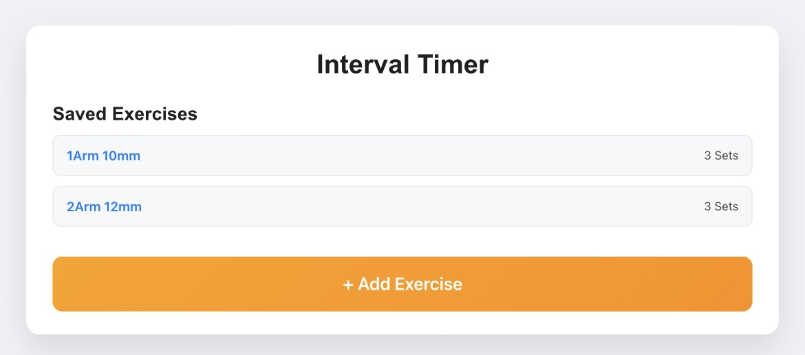
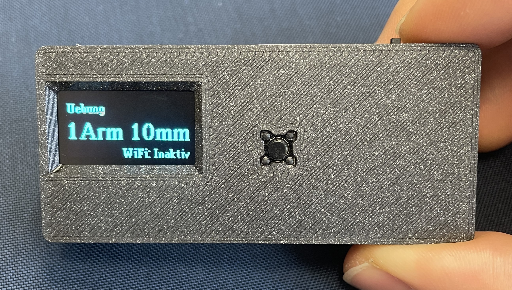

# IntervalTimer_for_ESP32C3

Store custom Hangboard exercises via WiFi.


---

## Electronics

### Part List
- **Board**: Xiao Seeed ESP32C3
- **Display**: 128x64px 0.96" OLED Display
  - Example: [Reichelt OLED Display](https://www.reichelt.de/de/de/shop/produkt/arduino_-_display_0_96_oled-display_ssd1306-320600)
- **Button**: Standard 2-pin button (6x6x4mm)
- **Lever**: two-position lever switch
- **Battery**: EREMIT 653040, 3.7V 800mAh LiPo Battery

### Layout
- Placeholder for layout description.

---

## Software

### Setup VSCode & PlatformIO
1. Clone the repository:
   ```bash
   git clone https://github.com/Apfailsine/IntervalTimer
   ```
2. Install the PlatformIO extension in VSCode.
3. Open the project folder in VSCode via the PlatformIO icon on the sidebar

### Build and Upload to ESP
1. Connect the board via a COM port.
2. Click on **PlatformIO: Upload** to flash the firmware to the board.

---

## Hardware

### Assembly
- Use a 3D-printed case (PLA). STL files are available in the `stls` folder.

---

## How to Use

### Connect to Web Interface
1. Switch on the board and press the button for at least 3 seconds.
2. The WiFi should now be active.
3. Use any device to connect to the WiFi network named `ESP32-IntervalTimer` with the password `12345678`.
4. Open a browser and navigate to `192.168.4.1`.
5. Add exercises via the web interface.



### Select Exercise
- **Short press**: Browse saved exercises.
- **Long press** (1–3 seconds): Select and start an exercise.
- after starting the exercise a 3 seconds "Get Ready!"-Timer starts
- **Short press**: Pause the timer.
- **Long press** (1-3 seconds): Stop the timer.



### Other Features
